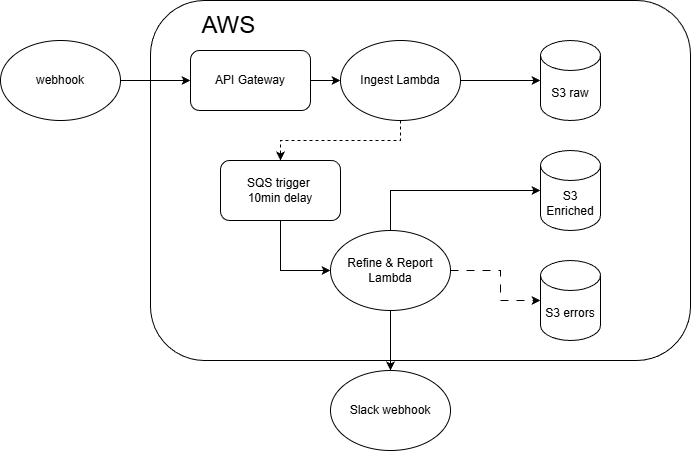

# Real-Time CRM Leads Automation Pipeline

This project automates the capture, enrichment, and notification of CRM leads using an AWS-native serverless architecture. It receives lead data via webhook events, stores them in S3, enriches the data with delayed assignment, and posts notifications to Slack.

---

## Overview

**Goal:** Build a fully automated, observable, and fault-tolerant data pipeline to process CRM leads with minimal infrastructure overhead.

**Core Features:**

* Capture new CRM leads via API Gateway webhook.
* Store incoming payloads in **S3 (Raw)**.
* Delay processing via **SQS** (10-minute buffer).
* Enrich data in **Lambda** (assignment handler).
* Store processed leads in **S3 (Enriched)**.
* Post notifications to **Slack**.
* Handle lookup failures gracefully via **S3 (Errors)**.

---

## Architecture



**AWS Components Used:**

* **API Gateway** – Public webhook endpoint.
* **Lambda** – Stateless compute for capture and enrichment.
* **S3** – Tiered storage: Raw, Enriched, and Error buckets.
* **SQS** – Delay queue for deferred enrichment.
* **Secrets Manager** – Stores Slack webhook URL.
* **CloudWatch** – Monitoring and centralized logging.

---

## Buckets

| Purpose       | Bucket Name                  | Example Path                                                    |
| ------------- | ---------------------------- | --------------------------------------------------------------- |
| Raw data      | `kerok-close-leads-raw`      | `crm/lead_created/dt=YYYY-MM-DD/lead_id=.../crm_event_...json`  |
| Enriched data | `kerok-close-leads-enriched` | `crm/lead_enriched/dt=YYYY-MM-DD/lead_id=.../lead_...json`      |
| Errors        | `kerok-close-leads-errors`   | `crm/errors/dt=YYYY-MM-DD/lead_id=.../owner_lookup_failed.json` |

---

## Lambdas

### 1. Capture Lambda

* Triggered by **API Gateway POST /crm**.
* Validates incoming payload.
* Stores the payload in the Raw S3 bucket.
* Triggers S3 → SQS event for delayed processing.

### 2. Assignment Handler Lambda

* Triggered by **SQS messages** (after delay).
* Reads raw JSON from S3.
* Looks up lead owner details from public S3 dataset.
* Writes enriched data to Enriched bucket.
* Sends Slack notifications.
* Writes failure events to Error bucket.

**Slack Notification Example:**

```
===New Lead Enriched===
Name: Jane Doe
Lead ID: lead_xxx
Created: 2025-11-19T12:00:00Z
Label: Qualified
Email: jane@example.com
Lead Owner: John Smith
Funnel: Website
```

---

## Secrets and Permissions

| Service             | Purpose                      | Notes                                                         |
| ------------------- | ---------------------------- | ------------------------------------------------------------- |
| AWS Secrets Manager | Stores Slack webhook (`url`) | Lambda retrieves dynamically                                  |
| IAM Roles           | Lambda execution             | Policies for `s3:*`, `sqs:*`, `secretsmanager:GetSecretValue` |
| S3 Bucket Policies  | Allows S3 to publish to SQS  | Configured via bucket notification                            |

---

## Error Handling

* **Transient lookup errors** → Retried up to 2 times.
* **Permanent lookup failures (e.g., 403/404)** → Written to error bucket.
* **Slack failure** → Logged in CloudWatch, not retried.
* **S3 write failure** → Raises exception, SQS reprocesses.

---

## Monitoring and Testing

**CloudWatch Logs:**

```bash
aws logs tail /aws/lambda/kerok-crm-assignment-handler --follow --region us-east-1
```

**Test Event (manual):**

```bash
curl -X POST https://hglryprvo7.execute-api.us-east-1.amazonaws.com/prod/crm \
  -H 'Content-Type: application/json' \
  -d '{
    "subscription_id": "whsub_test",
    "event": {
      "object_type": "lead",
      "lead_id": "lead_TEST001",
      "action": "created",
      "data": {
        "display_name": "Test Lead",
        "date_created": "2025-11-19T12:00:00Z",
        "status_label": "Potential"
      }
    }
  }'
```

**Verify Output:**

```bash
aws s3 ls s3://kerok-close-leads-enriched/crm/lead_enriched/ --recursive
```

---

## Status Summary

| Component           | Status        |
| ------------------- | ------------- |
| S3 Raw ingestion    | ✅ Active      |
| SQS event delivery  | ✅ Operational |
| Enrichment Lambda   | ✅ Working     |
| Error Bucket        | ✅ Functional  |
| Slack notifications | ✅ Active      |

---

## Next Steps

* Add retry dead-letter queue for failed enrichments.
* Add Athena querying for data lookup
* Add structured schema evolution for Parquet output.
* Extend Slack messages with region/team grouping.
* Optionally integrate with DynamoDB for persistent lead indexing.

---

**Author:** Kristoffer Kero
**Company:** Kerok Tech LLC
**Date:** November 11th 2025
